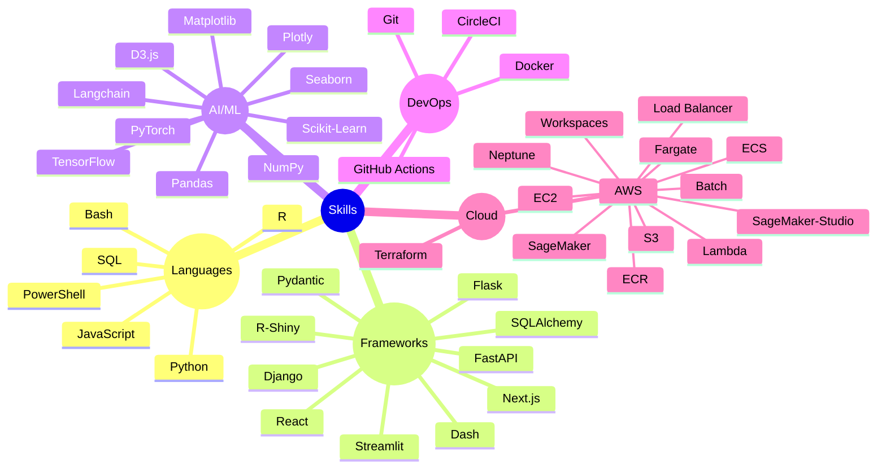

```
I want to put on my readme.md github profile, is it possible to do:

A [pattern-obsessed] ML Engineer, building production ML pipelines & explainable AI systems

And than adjective changes swifts with animation:

A [ensemble-everything] ML Engineer...
A [hyperparameter-tortured] ML Engineer...
A [latent-space-wandering] ML Engineer...
A [architecturally adventurous] ML Engineer...
A [efficiency-obsessed] ML Engineer...
```


```
<g transform="translate(40, 40)">
    <text class="adjective">pattern-obsessed</text>
    <text class="adjective">hyperparameter-tortured</text>
    <text class="adjective">latent-space-wandering</text>
    <text class="adjective">ensemble-everything</text>
    <text class="adjective">architecturally adventurous</text>
  </g>
```
 


---

<br><br><br>


<table>
  <tr>
    <td align="center" width="50"><a href="https://dduyg.github.io/" target="_blank"></a></td>
    <td rowspan="5"><p align="center">Hi there 👋🏼 I’m Duygu—an efficiency-obsessed ML Engineer and Logic Synthesiser. I design scalable pipelines and explainable AI systems that don’t just work, but make sense.</p><p align="center"><samp>I believe the best systems are explainable (if you can’t explain it, you don’t understand it), systematic (architecture is chaos, thoughtfully organized), and beautiful (code is craft, and aesthetics matter).</samp></p>

<div align="center">
  
    <details><summary>&nbsp; <samp>Currently</samp></summary><br>
  
*Currently exploring: Advanced model interpretability • Generative databases • Cloud Tech 🐍 ☁️*

<br>


</details>
</div></td>
  </tr>
  <tr>
    <td align="center" width="50"><a href="https://observablehq.com/user/@dduyg" target="_blank"></a></td>
  </tr>
  <tr>
    <td align="center" width="50"><a href="https://instagram.com/insert.data" target="_blank"></a></td>
  </tr>
  <tr>
    <td align="center" width="50"><a href="https://medium.com/@dduyg" target="_blank"></a></td>
  </tr>
  <tr>
    <td align="center" width="50"><a href="https://ko-fi.com/dduyg" target="_blank"></a></td>
  </tr>
</table>


---

<pre>

┌──┤ ABOUT ├─────────▰▰▰
│
├─▣ Data Scientist & Engineer
├─▣ Building production ML pipelines & explainable AI systems
├─▣ Exploring the intersection of data science & creativity
│
└───────────────────────────────▰▰▰

┌──┤ PROJECTS ├───────▰▰▰
│
├─◈ <a href="#">AutoML Toolkit</a>
├─◈ <a href="#">PyTorch Training Pipeline</a>
├─◈ <a href="#">SHAP Implementation Patterns</a>
├─◈ <a href="#">Neural Architecture Search</a>
├─◈ <a href="#">Feature Engineering Library</a>
│
└───────────────────────────────▰▰▰

</pre>


----


> [!WARNING]
> To show private statistics on the stats card, you should deploy using GitHub API token.

> [!NOTE]
> Made by Duygu who appreciate smooth animations

> [!IMPORTANT]
> system.log: { status: "abandoned server" }

---


