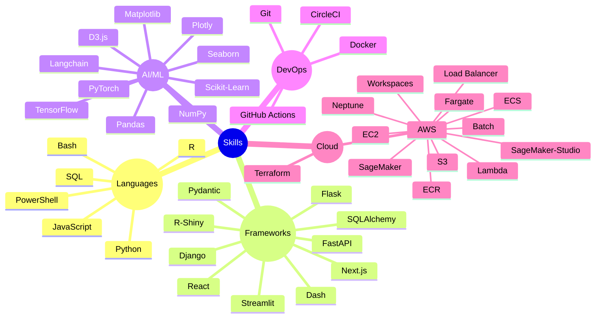

---

<div align="center">

A  ML Engineer, building production ML pipelines & explainable AI systems
</div>

## 👋 Hey there!

I'm Duygu, building ML systems that don't just work—they make sense.

I believe the best ML systems are:
- **Explainable** - If you can't explain it, you don't understand it
- **Systematic** - Chaos organized is just architecture
- **Beautiful** - Code is craft; aesthetics matter


```
I want to put on my readme.md github profile, is it possible to do:

A [pattern-obsessed] ML Engineer, building production ML pipelines & explainable AI systems

And than adjective changes swifts with animation:

A [ensemble-everything] ML Engineer...
A [hyperparameter-tortured] ML Engineer...
A [latent-space-wandering] ML Engineer...
A [architecturally adventurous] ML Engineer...
A [efficiency-obsessed] ML Engineer...
```


---

<div align="center">
  
*Currently exploring: Advanced model interpretability • Generative data visualization • The liminal space between art and algorithms*

</div>


```
<g transform="translate(40, 40)">
    <text class="adjective">pattern-obsessed</text>
    <text class="adjective">hyperparameter-tortured</text>
    <text class="adjective">latent-space-wandering</text>
    <text class="adjective">ensemble-everything</text>
    <text class="adjective">architecturally adventurous</text>
  </g>
```

---

<div align="center">

  **Hi there 👋🏼 I'm Duygu.**

<div align="center">
  <a href= "https://dduyg.github.io/" target="_blank"></a>&nbsp; <a href= "https://observablehq.com/user/@dduyg" target="_blank"></a>&nbsp; <a href= "https://instagram.com/insert.data" target="_blank"></a>&nbsp; <a href= "https://medium.com/@dduyg" target="_blank"></a>&nbsp; <a href= "https://ko-fi.com/dduyg" target="_blank"></a>
</div> 
 


<samp>I love creating new things with data and code.</samp><details><summary>&nbsp; <samp>Latest ↓</samp></summary>




</details>
</div>


---

<pre>

┌──┤ ABOUT ├─────────▰▰▰
│
├─▣ Data Scientist & Engineer
├─▣ Building production ML pipelines & explainable AI systems
├─▣ Exploring the intersection of data science & creativity
│
└───────────────────────────────▰▰▰

┌──┤ PROJECTS ├───────▰▰▰
│
├─◈ <a href="#">AutoML Toolkit</a>
├─◈ <a href="#">PyTorch Training Pipeline</a>
├─◈ <a href="#">SHAP Implementation Patterns</a>
├─◈ <a href="#">Neural Architecture Search</a>
├─◈ <a href="#">Feature Engineering Library</a>
│
└───────────────────────────────▰▰▰

</pre>


---

<table>
  <tr>
    <td align="center" width="50"><a href="#" target="_blank"></a></td>
    <td rowspan="5">Lorem ipsum dolor sit amet, consectetur adipiscing elit. Sed do eiusmod tempor incididunt ut labore et dolore magna aliqua. Ut enim ad minim veniam, quis nostrud exerci arcu. In enim justo rhoncus ut imperdiet a venenatis vitae justo. Add as much text as you want here and the icons will still show on the left.</td>
  </tr>
  <tr>
    <td align="center" width="50"><a href="#" target="_blank"></a></td>
  </tr>
  <tr>
    <td align="center" width="50"><a href="#" target="_blank"></a></td>
  </tr>
  <tr>
    <td align="center" width="50"><a href="#" target="_blank"></a></td>
  </tr>
  <tr>
    <td align="center" width="50"><a href="#" target="_blank"></a></td>
  </tr>
</table>


----


> [!WARNING]
> To show private statistics on the stats card, you should deploy using GitHub API token.

> [!NOTE]
> Made by Duygu who appreciate smooth animations

> [!IMPORTANT]
> system.log: { status: "abandoned server" }
